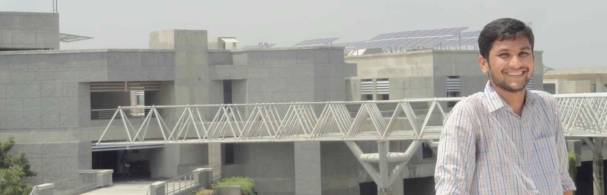

---		 
layout: About
title: About Me	
---	

         Hi, I’m your host, Akash Jadhav. I’m currently an undergraduate student pursuing my bachelor's in 
         computer science and engineering.    
      My interests include learning different programming languages, Data science & Machine Learning. 
      I also have a mild interest in medical science and aerospace engineering.
        
      Besides, I love to play chess very much. That's why I decided to name my blog as TheGambitier's Blog.
      'Gambit' (in chess) is an opening move in which a player makes a sacrifice, 
      typically of a pawn, for the sake of a compensating advantage.I love playing in that style. 
      <blockquote>If you can't explain it simply, you don't understand it well enough.  -Albert Einstein</blockquote>
        So, I want to understand things clearly, and explain them well. 
        I hpoe you will enjoy interesting (hope so!) blog posts.!!
       

 
