 

Matplotlib is a multi-platform data visualization library built on NumPy arrays.


```python
# installing dependencies
!pip install numpy
!pip install matplotlib
!pip install pandas
```


```python
# importing librarires
import matplotlib as mpl
import matplotlib.pyplot as plt
import numpy as np
import pandas as pd
```


```python
# Setting Styles
plt.style.use('classic')
```


```python
# To list all available styles, use:
print(plt.style.available)
```

    ['seaborn-bright', 'fast', '_classic_test', 'classic', 'ggplot', 'seaborn', 'seaborn-talk', 'seaborn-ticks', 'seaborn-deep', 'seaborn-white', 'dark_background', 'seaborn-colorblind', 'seaborn-paper', 'fivethirtyeight', 'seaborn-whitegrid', 'seaborn-dark', 'Solarize_Light2', 'seaborn-poster', 'bmh', 'seaborn-dark-palette', 'tableau-colorblind10', 'seaborn-darkgrid', 'seaborn-muted', 'grayscale', 'seaborn-pastel', 'seaborn-notebook']


# Plotting from an IPython/Jupyter notebook


Plotting interactively within an IPython notebook can be done if you specify Matplotlib mode. To enable this mode, you can use the %matplotlib magic command after starting ipython:

- ``%matplotlib notebook`` will lead to *interactive* plots embedded within the notebook
- ``%matplotlib inline`` will lead to *static* images of your plot embedded in the notebook

it needs to be done only once per kernel/session


```python
%matplotlib inline
```

# Terms


### Figure

* The whole figure. The figure keeps track of all the child Axes, a smattering of ‘special’ artists (titles, figure legends, etc), and the canvas. 

* A figure can have any number of Axes, but to be useful should have at least one.
 
* The easiest way to create a new figure is with pyplot:


```
fig = plt.figure()  # an empty figure with no axes
fig, ax_lst = plt.subplots(2, 2)  # a figure with a 2x2 grid of Axes

```

### Axes

* **The Axes contains most of the figure elements: Axis, Tick, Line2D, Text, Polygon, etc., and sets the coordinate system.**

* **The Axes class and it’s member functions are the primary entry point to working with the OO interface.**

* A given figure can contain many Axes, but a given Axes object can only be in one Figure. 

* The Axes contains two (or three in the case of 3D) Axis objects  which take care of the data limits 

* The data limits can also be controlled via set via the `set_xlim()` and `set_ylim()` Axes methods. 

* Each Axes has a title (set via set_title()), an x-label (set via `set_xlabel()`), and a y-label set via `set_ylabel()`.

### Axis

* These are the number-line-like objects.

* They take care of setting the graph limits and generating the ticks (the marks on the axis) and ticklabels (strings labeling the ticks).

### Artist

* Basically everything you can see on the figure is an artist (even the Figure, Axes, and Axis objects).

* When the figure is rendered, all of the artists are drawn to the canvas. 


# Types of inputs to plotting functions

All of plotting functions expect `np.array`  or `np.ma.masked_array` as input. Classes that are ‘array-like’ such as pandas data objects and np.matrix may or may not work as intended. It is best to convert these to np.array objects prior to plotting.


```python
a = pd.DataFrame(np.random.rand(4,5), columns = list('abcde'))
a.values
```


    array([[0.69249144, 0.14049831, 0.48518893, 0.70071801, 0.57683582],
           [0.7216881 , 0.55435044, 0.68774926, 0.31180173, 0.85159178],
           [0.74072171, 0.11777016, 0.26252409, 0.52488437, 0.46330762],
           [0.43196313, 0.91133141, 0.83722142, 0.41598821, 0.61068865]])


```python
b = np.matrix([[1,2],[3,4]])
np.asarray(b)
```


    array([[1, 2],
           [3, 4]])


# Stateful vs stateless approach


**matplotlib has dual interfaces: a convenient MATLAB-style state-based interface, and a more powerful object-oriented interface. **
 


### 1. stateful example:

* **There is only ever one Figure or Axes that you’re manipulating at a given time, and you don’t need to explicitly refer to it.**

* The stateful interface makes its calls with plt.plot() and other top-level pyplot functions.

* The MATLAB-style/stateful approach related tools are contained in the pyplot (plt) interface. 

* It is important to note that this interface is stateful: it keeps track of the "current" figure and axes, which are where all plt commands are applied. 


```python
x = np.linspace(0, 2, 100)

plt.plot(x, x, label='linear')
plt.plot(x, x**2, label='quadratic')
plt.plot(x, x**3, label='cubic')

plt.xlabel('x label')
plt.ylabel('y label')

plt.title("Simple Plot")

plt.legend()

plt.show()
```


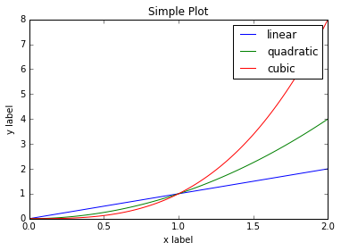


The flow of this process, at a high level, looks like this:


* Calling plt.plot() is just a convenient way to get the current Axes of the current Figure and then call its plot() method. 

* This is what is meant by the assertion that the stateful interface always “implicitly tracks” the plot that it wants to reference.

* pyplot is home to a batch of functions that are really just wrappers around matplotlib’s object-oriented interface

  * Calling plt.title() gets translated into this one line: gca().set_title(s, *args, **kwargs). 

  * Similarly, if you look at the source for top-level functions like plt.grid(), plt.legend(), and plt.ylabels(), you’ll notice that all of them follow the same structure of delegating to the current Axes with gca() and then calling some method of the current Axes.


```python
plt.plot([0,1], [1,0])
```


    [<matplotlib.lines.Line2D at 0x7f49a2802a58>]


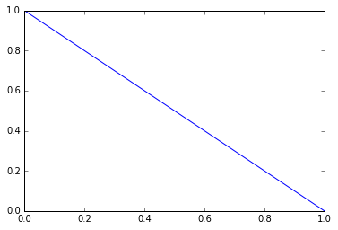


```python
# changing size of fig
plt.plot([0,1], [1,0])
plt.gcf().set_size_inches([10,8])
```


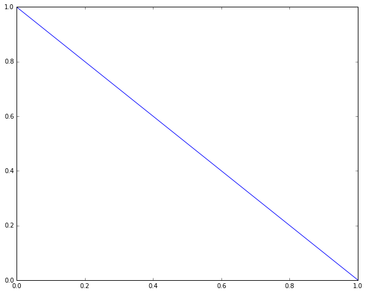


```python
# np.linspace return evenly spaced numbers over a specified interval.
x = np.linspace(0, 10, 1000)
plt.plot(x, np.sin(x))
```


    [<matplotlib.lines.Line2D at 0x7f49a259f898>]


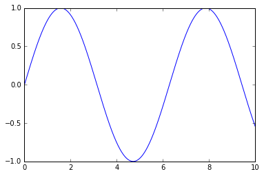


```python
# another example: subplot

# create the first of two panels and set current axis
plt.subplot(2, 1, 1) # (rows, columns, panel number)
plt.plot(x, np.sin(x))

# create the second panel and set current axis
plt.subplot(2, 1, 2)
plt.plot(x, np.cos(x));
```


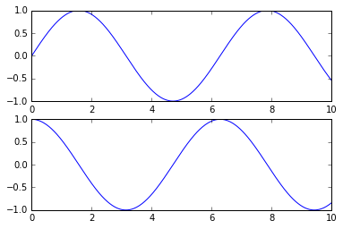


### 2. stateless (or rather object-oriented approach):

* Modifying the underlying objects directly is the object-oriented approach.

* thus we take the object references into variables (` fig, ax, li` ).

* and call plotting functions that are methods of explicit `Figure` and `Axes` objects

this approach is more customizable and comes handy as graphs become more complex.

** the only time that the OO approach uses pyplot, to create a Figure and Axes: **


```python
data = [0, 1, 2, 3, 4, 5, 6, 7, 8, 9, 10]
fig = plt.figure()
ax = plt.axes()
line = ax.plot(data)
```


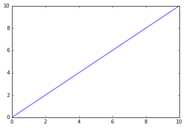


**what does argument in fig.add_subplot(111) mean?**

These are subplot grid parameters encoded as a single integer. For example, "111" means "1x1 grid, first subplot" and "234" means "2x3 grid, 4th subplot".

Alternative form for `add_subplot(111)` is `add_subplot(1, 1, 1)`.


```python
fig = plt.figure()
ax = fig.add_subplot(111)
li = ax.plot([0,1], [1,0])
fig.set_size_inches([10, 8])
```


```python
fig = plt.figure()
ax = plt.axes()
a = ax.plot(x, np.sin(x));
```


```python
# First create a grid of plots
# ax will be an array of two Axes objects
fig, ax = plt.subplots(2)

# Call plot() method on the appropriate object
ax[0].plot(x, np.sin(x))
ax[1].plot(x, np.cos(x));
```


# Saving Plots as images


```python
# np.linspace return evenly spaced numbers over a specified interval.
x = np.linspace(0, 10, 100)

# create a plot figure
fig = plt.figure()

plt.plot(x, np.sin(x), '-')
plt.plot(x, np.cos(x), '--');
```


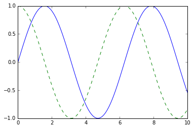


```python
# Saving Figures to File
fig.savefig('my_figure.png')
```


```python
ls
```

     Anaconda3-2018.12-Linux-x86_64.sh*   Programs/
     Compressed/                          squash.png
     Documents/                           teamviewer_14.1.3399_amd64.deb
     logo-64x64.png                       Video/
     Matplotlib.ipynb                    'week 2 questions-1.pdf'
     Music/                               xdm-2018-x64.tar.xz
     my_figure.png


```python
from IPython.display import Image
Image('my_figure.png')
```


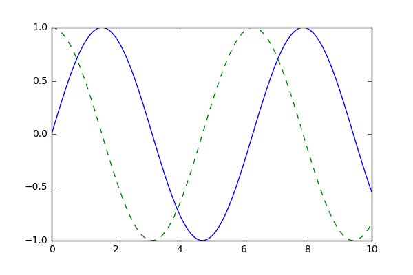


#  Basics

**For all Matplotlib plots, we start by creating a figure and an axes. In their simplest form, a figure and axes can be created as follows:**

* The purpose of using plt.figure() is to create a figure object.
* The whole figure is regarded as the figure object. 
* It is necessary to explicitly use plt.figure() when we want to tweak the size of the figure and when we want to add multiple Axes objects in a single figure.


```python
fig = plt.figure() # default size
fig = plt.figure(figsize=(12,8)) # specific 
```


    <Figure size 432x288 with 0 Axes>


    <Figure size 864x576 with 0 Axes>


```python
# Add an axes to the current figure and make it the current axes.
ax = plt.axes()
```


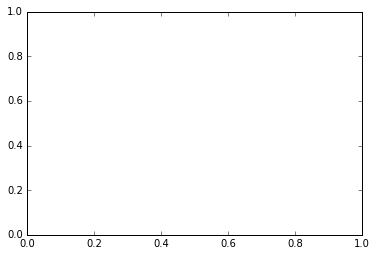


```python
fig, ax_lst = plt.subplots(2, 2) 
```


```python
ax_lst
```


    array([[<matplotlib.axes._subplots.AxesSubplot object at 0x7f49a2367eb8>,
            <matplotlib.axes._subplots.AxesSubplot object at 0x7f49a231e0b8>],
           [<matplotlib.axes._subplots.AxesSubplot object at 0x7f49a23472e8>,
            <matplotlib.axes._subplots.AxesSubplot object at 0x7f49a22ef518>]],
          dtype=object)


```python
fig1, ((ax1, ax2), (ax3, ax4)) = plt.subplots(2, 2)
```


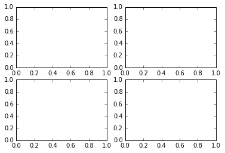


# plt.show()  v/s  plt.draw()

we have already discussed difference between plt.plot and ax.plot. 

### `plt.show()` 

it will display the current figure that you are working on.


```python
plt.plot([1,2,3],[4,5,1])
plt.show()
```


```python
x1 = np.random.rand(10)
x2 = np.random.rand(10)
x3 = np.random.rand(10)
x4 = np.random.rand(10)
y1 = np.random.rand(10)
y2 = np.random.rand(10)
y3 = np.random.rand(10)
y4 = np.random.rand(10)

figure2, ((ax1, ax2), (ax3, ax4)) = plt.subplots(2, 2)
ax1.plot(x1,y1)
ax2.plot(x2,y2)
ax3.plot(x3,y3)
ax4.plot(x4,y4)

plt.show()
```


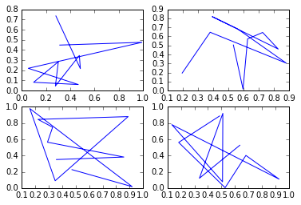


### plt.draw()


[reference](https://stackoverflow.com/questions/23141452/difference-between-plt-draw-and-plt-show-in-matplotlib)


**plt.draw() will re-draw the figure.**

The plt.draw docs state:

* This is used in interactive mode to update a figure that has been altered using one or more plot object method calls; 
* it is not needed if figure modification is done entirely with pyplot functions, if a sequence of modifications ends with a pyplot function, or if matplotlib is in non-interactive mode and the sequence of modifications ends with show() or savefig().

This seems to suggest that using plt.draw() before plt.show() when not in interactive mode will be redundant the vast majority of the time. The only time you may need it is if you are doing some very strange modifications that don't involve using pyplot functions.

Refer to the Matplotlib FAQ,["What is interactive mode?"](https://matplotlib.org/faq/usage_faq.html#what-is-interactive-mode) for more information.


```python

```

# Common Usecases

### Label and Title


```python
x=[5,8,10]
y=[12,16,6]
plt.plot(x,y)
plt.title('Info')
plt.xlabel('X axis')
plt.ylabel('Y axis')
plt.show()
```


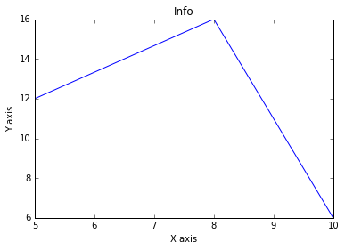


### How to use style in graph


```python
plt.style.use('ggplot')
x=[5,8,10]
y=[12,16,6]
x2=[6,9,11]
y2=[6,15,7]
plt.plot(x,y, 'g',label='line one',linewidth=5)
plt.plot(x,y,'c',label='line two',linewidth=5)
plt.title('Epic Info')
plt.xlabel('X axis')
plt.ylabel('Y axis')
plt.legend()
plt.grid(True,color='k')
plt.show()
```


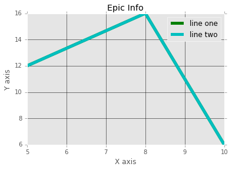


### Bar Graph


```python
plt.bar([1,3,5,7,9],[5,2,7,8,2], label= 'Example one')
plt.bar([2,4,6,8,10],[8,6,2,5,6], label= 'Example two',color='g')
plt.legend()
plt.title('Info')
plt.xlabel('bar number')
plt.ylabel('bar height')
plt.show()
```


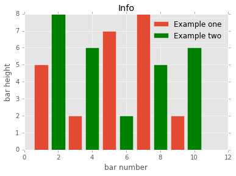


### Histogram


```python
population_ages = [22,55,62,45,21,22,34,42,42,4,99,102,110,120,121,122,130,111,115]
bins=[0,10,20,30,40,50,60,70,80,90,100, 110,120,130]
plt.hist(population_ages, bins, histtype='bar', rwidth=0.8)
plt.title('Histogram')
plt.xlabel('x')
plt.ylabel('y')
plt.legend()
plt.show()
```

    No handles with labels found to put in legend.


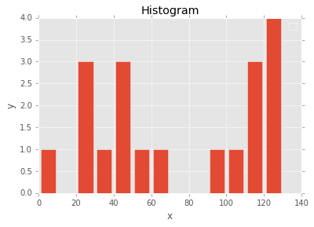


### Scatter Plot


```python
x=[1,2,3,4,5,6,7,8]
y=[5,2,4,2,1,4,5,2]
plt.scatter(x,y, label='skitscat', color='k')
plt.title('Scatter Plot')
plt.xlabel('x')
plt.ylabel('y')
plt.legend()
plt.show()
```


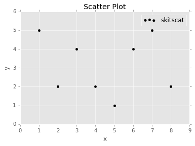


### Stack Plot


```python
days=[1,2,3,4,5]
sleeping=[7,8,6,11,7]
eating=[2,3,4,3,2]
working=[7,8,7,2,2]
playing=[8,5,7,8,13]
plt.plot([],[],color= 'm', label='Sleeping', linewidth=5)
plt.plot([],[],color= 'c', label='Eating', linewidth=5)
plt.plot([],[],color= 'r', label='Working', linewidth=5)
plt.plot([],[],color= 'k', label='Playing', linewidth=5)
plt.stackplot(days,sleeping,eating,working,playing, colors= ['m', 'c', 'r', 'k'])
plt.title('Stck Plot')
plt.xlabel('x')
plt.ylabel('y')
plt.legend()
plt.show()
```


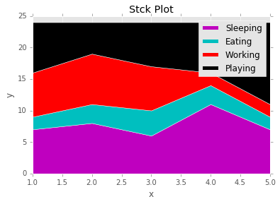

